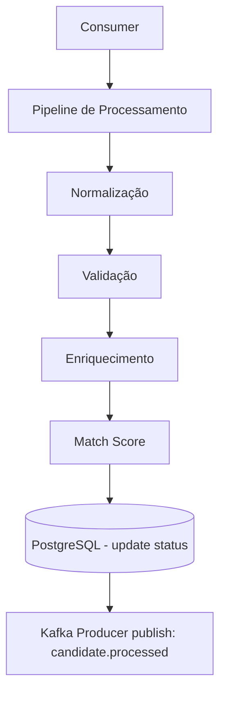

# Candidate Processor API

O Candidate Processor API consome eventos candidate.created, normaliza, valida, enriquece e calcula match score.
Após o processamento, atualiza o banco e publica candidate.processed.

Este serviço simula um pipeline real de análise automática de candidatos usado em plataformas ATS modernas.

🎯 Objetivos

* Consumir eventos de criação de candidato
* Executar pipeline assíncrono (normalização + enriquecimento)
* Calcular senioridade
* Calcular match score baseado em regras
* Atualizar status
* Publicar novo evento (candidate.processed)

🧱 Tecnologias

* Java 21+
* Spring Boot 3
* Spring Kafka (Consumer + Producer)
* PostgreSQL
* JPA
* Docker Compose
* Testcontainers

🏗 Arquitetura — Candidate Processor

🔧 Pipeline Detalhado
1. Normalização
- nome capitalizado
- e-mail saneado
- skills normalizadas

2. Validação

- e-mail válido
- telefone com formato correto

3. Enriquecimento

- detectar senioridade
- identificar skills críticas

4. Match Score
- Regras configuráveis
